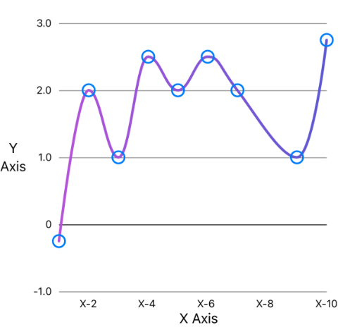

# Charties - Charts in SwiftUI

Swift package to show customizable charts built in SwiftUI.

This is a package I'm building out of personal need to easily create configurable, reusable, and beautiful charts. I'm starting with a **scatter plot chart**, which is specifically the type of chart I need and was not available in other existing chart packages.

I'll be updating this document with images and general usage documentation as progress is made in the development of the package.

## Line Chart



### Usage
```swift
let dataPoints = [(x: 1.0, y: -0.25), (x: 3, y: 1), (x: 4, y: 2.5), (x: 6, y: 1), (x: 10, y: 2.75)]
var chartData = ChartData(dataPoints, xAxisTitle: "Day", yAxisTitle: "pH", yAxisGridlineStep: 1)

let chart = LineChart(data: chartData,
                      marker: Text("❌"),               // Marker can be any view! Make sure to fix it's frame when needed. 
                      lineStyle: .smooth(Color.blue))   // Line be smooth or straigth. The line can be a color, gradient or any other `ShapeStyle`. 
```

## Scatter Chart

*Coming soon...*
